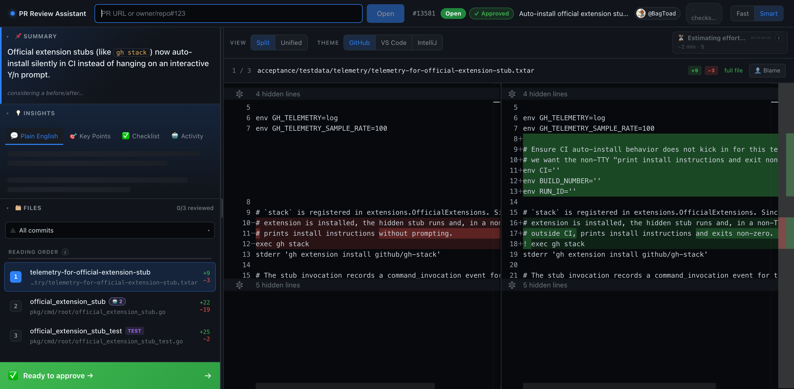

# PR Review Assistant

A localhost web app that helps you understand a GitHub pull request *fast* — a concrete TL;DR and a real diff viewer, side by side — before you read a line of code.

Runs entirely on your machine: your local `gh` CLI for GitHub, your local `claude` CLI for AI. **No API keys, no telemetry.** Your code only goes where your own `claude` CLI already sends it.



---

## Quick start

```bash
git clone https://github.com/shacharPash/pr-review-assistant.git && cd pr-review-assistant && npm start
```

`npm start` checks your tools, installs deps, then opens `http://localhost:5173`. Paste any GitHub PR URL and hit **Open**. Already cloned it? Just `git pull && npm start`.

*(Missing `gh` or `claude`? The setup script and a banner in the app tell you exactly what to install — the diff still works without AI.)*

---

## What you get

**Understand the PR** — a left panel with everything you need to get oriented:
- **Summary** — one-sentence headline + a **Before / After** comparison
- **🎯 Key Points** — concrete cards naming the *core change*, the *main risk*, and *context* (per file/line)
- **💬 Plain English** — a friendly two-paragraph explanation
- **✅ Checklist** — things to verify before approving; built from the linked **Jira ticket's acceptance criteria** when there is one, otherwise AI-generated
- **🤖 Activity** — summaries from other reviewers/bots (Claude Code, Cursor BugBot, SonarCloud, …)
- A **PR status badge** in the header (Draft / Open / Merged / Closed) + the review decision
- Collapse any panel to give the **code the full screen**

**Read the code** — a real Monaco side-by-side diff:
- Syntax highlighting + 3 themes; **git blame** gutter with age coloring
- **Signal over noise** — files reading-ordered (code before tests); lockfiles/generated/imports-only hunks hidden by default
- **Expand context** around any hunk without opening the whole file
- **Commit selector** — all commits, one commit, or "since my last review"

**Review** (open PRs only):
- Inline line comments — with **✨ AI suggest-fix** and **✨ enhance-comment** helpers
- Submit as a GitHub review (Approve / Comment / Request changes). On merged/closed PRs the review actions are replaced with a status note — no false "Ready to approve".

**Speed/cost** — a **Fast / Smart** toggle (Sonnet everywhere vs. Opus where reasoning helps) and a per-session token-usage badge.

---

## Requirements

| Tool | Why | Install |
|---|---|---|
| Node.js 20+ | Runtime | https://nodejs.org |
| `gh` CLI | Fetch the PR/diff, post reviews | https://cli.github.com → `gh auth login` |
| `claude` CLI | AI summaries & suggestions | https://claude.ai/code |

`npm start` verifies all three and prints fix hints if any are missing.

---

## Optional: Jira

If your PRs reference tickets like `RED-12345`, copy `.env.example` to `.env` (the setup script does this) and add:

```bash
JIRA_BASE_URL=https://your-org.atlassian.net   # clickable ticket badges
JIRA_EMAIL=you@your-org.com                     # + fetch title/status and
JIRA_API_TOKEN=...                              #   power the Jira-aware Checklist
```

The `.env` is gitignored. Restart after editing.

---

## How it works

- **Server** (`/server`) — Node + Express (Vite middleware in dev). Wraps the `gh` and `claude` CLIs, parses diffs, streams AI output over SSE.
- **Client** (`/client`) — React + TypeScript + Zustand; Monaco for the diff.
- **Shared types** (`/shared`).

Single command, single port, no database. PRs are cached in memory by commit SHA, so re-opening one is instant and new commits invalidate it automatically.

---

## Scripts

```bash
npm start        # setup + dev server (first-time friendly)
npm run dev      # dev server on :5173 (deps already installed)
npm run build    # production build
npm run typecheck
npm test         # unit tests (vitest)
```

---

## Privacy

The server runs on `localhost` and opens no outbound connections beyond what `gh` and `claude` already do for you. `gh` uses your existing GitHub auth; `claude` sends prompts (including diff content) through your own Claude account — the same path as running `claude` yourself. No telemetry.

---

## License

MIT — see [LICENSE](LICENSE). Issues and PRs welcome.
